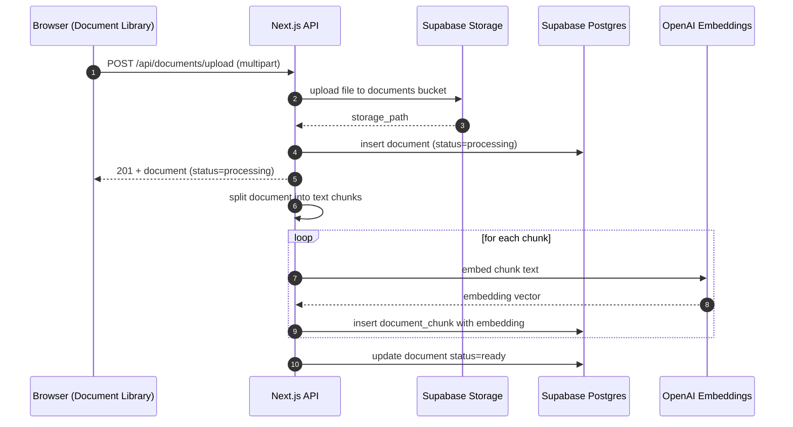
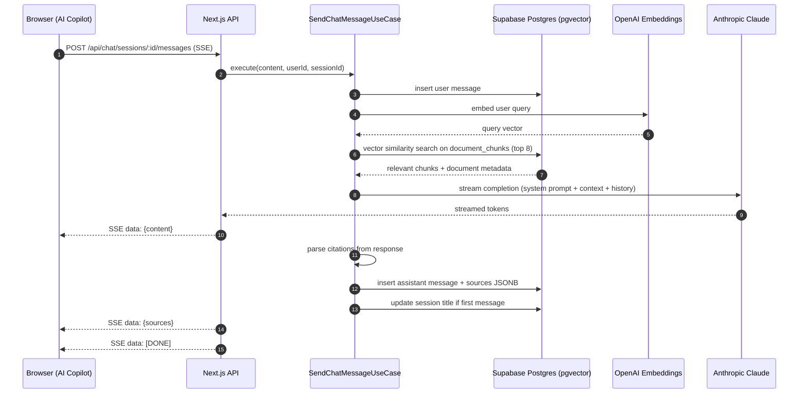

# Chemico Compliance & SDS Intelligence Copilot — System Overview

Last updated: 2026-04-15

## Purpose

The Chemico Compliance & SDS Intelligence Copilot is an AI-powered web application built by Zaigo for The Chemico Group. It ingests Safety Data Sheets (SDS), product specifications, regulatory documents, customer audits, and internal SOPs, then lets compliance teams ask plain-English questions and receive instant, cited answers. The system surfaces compliance risk across Chemico's 50 locations, reduces manual review labor, and documents compliance at every site — protecting enterprise value ahead of any equity event or buyer due diligence.

This is a mockup with mock data and a live Claude AI backend, built to demonstrate the solution to Chemico leadership (Leon C. Richardson and team).

## Stack and Runtime

- Framework: Next.js 16 App Router (React Server Components by default).
- UI: React 19, Tailwind CSS, shadcn/ui component library.
- Auth + DB: Supabase (Auth, Postgres with pgvector, Storage).
- Embeddings: OpenAI `text-embedding-3-small` for document chunk vectorization.
- LLM: Anthropic Claude claude-sonnet-4-6 for compliance chat (streaming, real responses, non-deterministic).
- Deployment: Vercel.

## Architecture Overview (Clean Architecture)

- Presentation Layer: `src/app` routes (App Router), `src/components` UI, `src/contexts` providers.
- Application Layer: `src/application/use-cases` orchestrates workflows (chat, document ingestion, site compliance, reporting).
- Domain Layer: `src/domain` entities, repository interfaces, service interfaces, and constants.
- Infrastructure Layer: `src/infrastructure` implements repositories and external services (Supabase, Anthropic, OpenAI embeddings); DI container in `src/infrastructure/factories/container.ts`.
- Shared Utilities: `src/lib` (SSE helpers, error responses, Supabase client helpers, logging, text chunking).

## Router Topology

- Public routes: `/` (redirects to `/dashboard`), auth pages.
- Auth routes: `/login`, `/auth/callback`.
- Protected routes: `/dashboard`, `/copilot`, `/documents`, `/sites`, `/reports` (enforced by middleware auth check).
- Middleware: `src/middleware.ts` refreshes Supabase session and redirects unauthenticated requests to `/login`.

## Pages

| Route | Page | Description |
|---|---|---|
| `/dashboard` | Dashboard | Compliance health overview — KPIs, alerts, site risk summary, trend charts |
| `/copilot` | AI Copilot | Chat interface — ask plain-English compliance questions, get cited AI answers |
| `/documents` | Document Library | Upload and browse SDS sheets, SOPs, regulatory docs, customer audits |
| `/sites` | Sites | Compliance status per location across Chemico's 50 sites |
| `/reports` | Reports | SARA threshold reports, VOC reports, audit history, export |

## External Services and Responsibilities

- Supabase
  - Auth: session management via RSC and middleware.
  - Postgres + pgvector: stores documents, chunks with embeddings, sites, chat sessions, messages, alerts, reports.
  - Storage: `documents` bucket for uploaded SDS/SOP files.
- OpenAI
  - `text-embedding-3-small` to generate vector embeddings for document chunks.
- Anthropic
  - `claude-sonnet-4-6` for streaming compliance chat responses with citations.

## Data Model (Supabase)

### Tables

- `documents` — uploaded compliance documents (SDS, SOPs, regs, audits)
- `document_chunks` — chunked + embedded document content for RAG retrieval
- `sites` — Chemico's 50 physical locations
- `chat_sessions` — copilot conversation sessions
- `chat_messages` — individual messages with role, content, and citation sources
- `compliance_alerts` — flagged compliance issues per site or document
- `reports` — generated compliance reports (SARA, VOC, audit)

---

### Canonical Schema

#### `documents`

| Column | Type | Nullable | Notes |
|---|---|---|---|
| `id` | uuid | no | Primary identifier. |
| `user_id` | uuid | no | Supabase Auth user. |
| `filename` | text | no | Original filename. |
| `doc_type` | text | no | Enum: `sds`, `sop`, `regulatory`, `audit`, `spec`. |
| `site_id` | uuid | yes | Optional — links document to a specific site. |
| `status` | text | no | Enum: `processing`, `ready`, `failed`. |
| `storage_path` | text | yes | Path in Supabase Storage `documents` bucket. |
| `page_count` | int | yes | Number of pages (PDF). |
| `error_message` | text | yes | Failure reason if status = `failed`. |
| `created_at` | timestamptz | no | Insert time. |
| `updated_at` | timestamptz | no | Update time. |

Query patterns:
- Filter by `user_id`, `doc_type`, `site_id`, `status`.
- Order by `created_at` desc.

#### `document_chunks`

| Column | Type | Nullable | Notes |
|---|---|---|---|
| `id` | uuid | no | Primary identifier. |
| `document_id` | uuid | no | Parent document. |
| `chunk_index` | int | no | Position within document. |
| `content` | text | no | Raw text content of the chunk. |
| `embedding` | vector(1536) | yes | OpenAI embedding for semantic search. |
| `created_at` | timestamptz | no | Insert time. |

Query patterns:
- Vector similarity search using pgvector `<=>` operator.
- Filter by `document_id`.

#### `sites`

| Column | Type | Nullable | Notes |
|---|---|---|---|
| `id` | uuid | no | Primary identifier. |
| `name` | text | no | Site display name. |
| `city` | text | no | City. |
| `state` | text | no | State abbreviation. |
| `country` | text | no | Country code (US, MX). |
| `industry` | text | no | Primary industry served at this site. |
| `compliance_score` | int | yes | 0–100 score; computed from alerts. |
| `status` | text | no | Enum: `compliant`, `at_risk`, `non_compliant`. |
| `created_at` | timestamptz | no | Insert time. |
| `updated_at` | timestamptz | no | Update time. |

Query patterns:
- List all sites ordered by `compliance_score` asc (worst first).
- Filter by `status`, `state`, `industry`.

#### `chat_sessions`

| Column | Type | Nullable | Notes |
|---|---|---|---|
| `id` | uuid | no | Session identifier. |
| `user_id` | uuid | no | Owner user. |
| `title` | text | yes | Auto-generated from first message. |
| `created_at` | timestamptz | no | Insert time. |
| `updated_at` | timestamptz | no | Update time. |

#### `chat_messages`

| Column | Type | Nullable | Notes |
|---|---|---|---|
| `id` | uuid | no | Message identifier. |
| `session_id` | uuid | no | Parent session. |
| `user_id` | uuid | no | Owner user. |
| `role` | text | no | `user` or `assistant`. |
| `content` | text | no | Message body. |
| `sources` | jsonb | yes | Array of cited document chunks with document metadata. |
| `created_at` | timestamptz | no | Insert time. |

#### `compliance_alerts`

| Column | Type | Nullable | Notes |
|---|---|---|---|
| `id` | uuid | no | Alert identifier. |
| `site_id` | uuid | yes | Linked site (nullable for org-wide alerts). |
| `document_id` | uuid | yes | Linked document if applicable. |
| `severity` | text | no | Enum: `critical`, `warning`, `info`. |
| `category` | text | no | Enum: `sds_missing`, `regulation_change`, `audit_due`, `threshold_exceeded`, `training_due`. |
| `title` | text | no | Short alert title. |
| `description` | text | no | Full alert description. |
| `status` | text | no | Enum: `open`, `acknowledged`, `resolved`. |
| `created_at` | timestamptz | no | Insert time. |
| `updated_at` | timestamptz | no | Update time. |

#### `reports`

| Column | Type | Nullable | Notes |
|---|---|---|---|
| `id` | uuid | no | Report identifier. |
| `user_id` | uuid | no | Owner user. |
| `report_type` | text | no | Enum: `sara_threshold`, `voc`, `audit_history`, `site_compliance`. |
| `title` | text | no | Report display name. |
| `site_id` | uuid | yes | Scoped to a site if applicable. |
| `period_start` | date | yes | Reporting period start. |
| `period_end` | date | yes | Reporting period end. |
| `status` | text | no | Enum: `generating`, `ready`, `failed`. |
| `created_at` | timestamptz | no | Insert time. |

### Supabase Storage

- Bucket: `documents`
- Object path pattern: `<userId>/<documentId>/<filename>`
- Used for original SDS/SOP file storage and download.

## Core Workflows

### 1) Authentication and Session

- Server components call `createClient()` from `src/lib/supabase/server.ts` to read the session from cookies.
- Middleware (`src/middleware.ts`) runs on every request to refresh session cookies and redirect unauthenticated users to `/login`.
- Login uses Supabase Auth on `src/app/(auth)/login` page.
- Auth callback (`/auth/callback`) exchanges Supabase auth code for session.

### 2) Document Upload and Ingestion

- UI: Document Library upload panel accepts PDF, DOCX files (SDS, SOP, regulatory, audit, spec).
- Upload flow:
  - Client posts file to `POST /api/documents/upload`.
  - Server writes file to Supabase Storage.
  - Server creates `documents` record with `status = processing`.
  - Background ingestion: server splits document into chunks, generates OpenAI embeddings per chunk, stores in `document_chunks` with `embedding` vector.
  - Document status updated to `ready` on completion or `failed` on error.
- Maximum file size: 50MB.
- Supported types: `application/pdf`, `application/vnd.openxmlformats-officedocument.wordprocessingml.document`.

### 3) Compliance Chat (RAG)

- User types a plain-English question in the Copilot page.
- Client sends message to `POST /api/chat/sessions/:id/messages` (SSE).
- `SendChatMessageUseCase`:
  - Stores user message.
  - Embeds the user query using OpenAI `text-embedding-3-small`.
  - Performs vector similarity search against `document_chunks` using pgvector — retrieves top 8 chunks.
  - Builds a context block with numbered source references and Chemico-specific system prompt.
  - Streams Claude claude-sonnet-4-6 response via Anthropic SDK.
  - Parses citations from the response, maps them to source chunks and parent documents.
  - Stores assistant message with `sources` JSONB payload.
  - Auto-generates session title from first exchange.
- Response streams token-by-token to the client via SSE.

### 4) Dashboard Metrics

- `GET /api/dashboard` aggregates:
  - Overall compliance score (average across all sites).
  - Open alert counts by severity (`critical`, `warning`, `info`).
  - Sites at risk count.
  - SDS documents pending review count.
  - Compliance trend over the last 30 days (mock time-series).
- All values are computed from Supabase data (mix of real DB queries and seeded mock data).

### 5) Site Compliance View

- `GET /api/sites` returns all 50 sites with compliance scores and statuses.
- `GET /api/sites/:id` returns site detail: documents linked to the site, open alerts, compliance history.
- Compliance score is derived from open alert count and severity weighting.

### 6) Report Generation

- User selects report type (SARA threshold, VOC, audit history, site compliance) and optional filters (site, date range).
- `POST /api/reports` creates a report record with `status = generating`.
- Report content is assembled from Supabase data and returned as structured JSON for rendering.
- Reports can be exported as PDF (future — stubbed in UI for mockup).

## API Surface (App Router)

- Dashboard
  - `GET /api/dashboard` — aggregated compliance metrics for the dashboard.
- Chat
  - `GET /api/chat/sessions` — list sessions.
  - `POST /api/chat/sessions` — create session.
  - `DELETE /api/chat/sessions/:id` — delete session.
  - `PATCH /api/chat/sessions/:id/title` — rename session.
  - `GET /api/chat/sessions/:id/messages` — fetch message history.
  - `POST /api/chat/sessions/:id/messages` — stream AI response (SSE).
- Documents
  - `GET /api/documents` — list documents with filters.
  - `POST /api/documents/upload` — upload a compliance document.
  - `DELETE /api/documents/:id` — delete document and its chunks.
  - `GET /api/documents/:id/download` — download original file from Supabase Storage.
- Sites
  - `GET /api/sites` — list all sites with compliance status.
  - `GET /api/sites/:id` — get site detail (documents, alerts, score history).
- Alerts
  - `GET /api/alerts` — list compliance alerts with filters (severity, status, site).
  - `PATCH /api/alerts/:id` — update alert status (acknowledge, resolve).
- Reports
  - `GET /api/reports` — list generated reports.
  - `POST /api/reports` — generate a new report.
  - `GET /api/reports/:id` — fetch report detail.

## API Contracts and Examples

All routes require an authenticated Supabase session cookie. Errors return `{ error: string }` with appropriate HTTP status.

### GET /api/dashboard

Response:
```json
{
  "overallScore": 74,
  "alerts": {
    "critical": 3,
    "warning": 11,
    "info": 24
  },
  "sitesAtRisk": 8,
  "sdsPendingReview": 17,
  "totalDocuments": 142,
  "totalSites": 50,
  "complianceTrend": [
    { "date": "2026-03-15", "score": 68 },
    { "date": "2026-03-22", "score": 71 },
    { "date": "2026-03-29", "score": 73 },
    { "date": "2026-04-05", "score": 74 }
  ]
}
```

### GET /api/chat/sessions

Response:
```json
{
  "sessions": [
    {
      "id": "s1...",
      "userId": "u1...",
      "title": "Disposal requirements at Detroit plant",
      "createdAt": "2026-04-14T10:00:00.000Z",
      "updatedAt": "2026-04-14T10:05:00.000Z"
    }
  ]
}
```

### POST /api/chat/sessions/:id/messages

Request:
```json
{ "content": "Which products require special disposal at the Detroit plant?" }
```

Response (SSE stream):
```
data: {"content":"Based on the SDS documentation for your Detroit location, the following products require special disposal procedures:"}

data: {"content":" **Chemico 2450 Lemon Neutra Quat Disinfectant** [1] must be disposed of in accordance with..."}

data: {"sources":[{"id":"chunk-12","documentId":"d1...","filename":"Chemico_2450_SDS.pdf","docType":"sds","excerpt":"Special disposal instructions: Do not dispose into drains..."}]}

data: [DONE]
```

### GET /api/documents

Request params: `?doc_type=sds&status=ready&site_id=<uuid>`

Response:
```json
{
  "documents": [
    {
      "id": "d1...",
      "filename": "Chemico_2450_SDS.pdf",
      "docType": "sds",
      "status": "ready",
      "siteId": null,
      "pageCount": 12,
      "createdAt": "2026-04-01T09:00:00.000Z"
    }
  ],
  "total": 142
}
```

### POST /api/documents/upload

Request (multipart form-data):
```
file=<binary>
doc_type=sds
site_id=<uuid>   (optional)
```

Response:
```json
{
  "document": {
    "id": "d2...",
    "filename": "MetalworkingFluid_SDS.pdf",
    "docType": "sds",
    "status": "processing"
  }
}
```

### GET /api/sites

Response:
```json
{
  "sites": [
    {
      "id": "site-1...",
      "name": "Detroit Automotive Plant",
      "city": "Detroit",
      "state": "MI",
      "country": "US",
      "industry": "Automotive",
      "complianceScore": 58,
      "status": "at_risk",
      "openAlerts": 4
    }
  ],
  "total": 50
}
```

### GET /api/alerts

Request params: `?severity=critical&status=open`

Response:
```json
{
  "alerts": [
    {
      "id": "a1...",
      "siteId": "site-1...",
      "siteName": "Detroit Automotive Plant",
      "severity": "critical",
      "category": "sds_missing",
      "title": "Missing SDS — Metalworking Fluid Concentrate",
      "description": "No SDS on file for Metalworking Fluid Concentrate used at this location. Required for OSHA HazCom compliance.",
      "status": "open",
      "createdAt": "2026-04-10T08:00:00.000Z"
    }
  ],
  "total": 3
}
```

### POST /api/reports

Request:
```json
{
  "reportType": "sara_threshold",
  "siteId": "site-1...",
  "periodStart": "2026-01-01",
  "periodEnd": "2026-03-31"
}
```

Response:
```json
{
  "report": {
    "id": "r1...",
    "reportType": "sara_threshold",
    "title": "SARA Threshold Report — Detroit Automotive Plant Q1 2026",
    "status": "generating"
  }
}
```

## Sequence Diagrams

### Document Upload and Ingestion



### Compliance Chat (RAG + Streaming)



## Streaming Protocol (SSE)

- `data: {"content": "..."}` — incremental token chunks from Claude.
- `data: {"sources": [...]}` — citation array after streaming completes (indices map to in-text citation markers).
- `data: {"error": "..."}` — error message.
- `data: [DONE]` — stream termination.

## Mock Data

The application is seeded with realistic mock data to support the demo:

- **50 sites** across 30 states and 4 countries (U.S. and Mexico), spanning automotive, aerospace, biopharma, electronics, defense, and government industries.
- **Compliance alerts** with realistic categories: missing SDS, upcoming audit deadlines, SARA threshold exceedances, VOC limit warnings, training due dates.
- **Documents** — pre-seeded SDS sheets for chemicals relevant to Chemico's operations: metalworking fluid concentrates, industrial degreasers, paint booth cleaning agents, hand sanitizers, specialty solvents.
- **Compliance scores** per site with intentional variance — some sites compliant, some at-risk, some non-compliant — to demonstrate the dashboard meaningfully.
- **Reports** — pre-generated SARA and VOC report examples.

Seed script: `scripts/seed.ts`

## System Prompt (AI Copilot)

The Claude system prompt positions the AI as Chemico's compliance assistant:

```
You are a compliance intelligence assistant for The Chemico Group, the largest minority-owned chemical management company in the United States. You have access to Chemico's Safety Data Sheets (SDS), standard operating procedures (SOPs), regulatory documents, customer audits, and internal compliance records.

Your role is to help Chemico's compliance teams, EH&S managers, and field staff get instant, accurate answers about chemical safety, disposal requirements, regulatory thresholds, and compliance obligations across all 50 Chemico locations.

When answering:
- Always cite the specific document and section your answer is drawn from using [n] notation.
- Be precise about chemical names, regulatory references (OSHA HazCom, SARA Title III, EPA VOC limits, RCRA), and site-specific requirements.
- Flag any compliance risks or gaps you identify.
- If information is not available in the provided documents, say so clearly rather than speculating.

The industries Chemico serves include automotive, aerospace, biopharmaceuticals, electronics, defense, and government — each with distinct compliance obligations.
```

## UI Composition

- Layouts
  - `src/app/layout.tsx` — root metadata, fonts, theme provider (shadcn/ui).
  - `src/app/(protected)/layout.tsx` — auth gating, sidebar navigation, providers.
- Pages
  - `/dashboard` — KPI cards, alert summary, compliance score chart, sites-at-risk table.
  - `/copilot` — chat interface with session list sidebar, streaming message display, citation cards.
  - `/documents` — file uploader, document table with filters (type, site, status), document detail panel.
  - `/sites` — sites table with compliance scores, status badges, filter by state/industry; site detail drawer.
  - `/reports` — report type selector, generated reports list, report detail view.
- Key Components
  - `ComplianceScoreCard` — circular score display with status color coding.
  - `AlertBadge` — severity-colored badge (critical/warning/info).
  - `ChatInterface` — session management, streaming message rendering, citation display.
  - `CitationCard` — expandable card showing cited document excerpt and source metadata.
  - `SiteStatusTable` — sortable table of all 50 sites with compliance status.
  - `DocumentUploader` — drag-and-drop upload with doc_type selector.

## Caching Behavior

- SSE endpoints return `text/event-stream` with `Cache-Control: no-cache`.
- Dashboard metrics fetched with `cache: no-store`.
- Document downloads return `Cache-Control: private, max-age=3600`.

## Key Constants and Limits

- Max file upload size: 50MB.
- Document chunk size: ~500 tokens per chunk, 50-token overlap.
- RAG retrieval topK: 8 chunks per query.
- Supported file types: PDF, DOCX.
- Mock sites count: 50.
- Compliance score range: 0–100 (100 = fully compliant).

## Canonical Entry Points (Where to Start)

- UI and routing: `src/app` and `src/components`.
- Business workflows: `src/application/use-cases`.
- Domain model: `src/domain`.
- Infrastructure integrations: `src/infrastructure` (Supabase, Anthropic, OpenAI).
- Dependency wiring: `src/infrastructure/factories/container.ts`.
- Mock data seed: `scripts/seed.ts`.
- System prompt: `src/lib/prompts/compliance.ts`.
